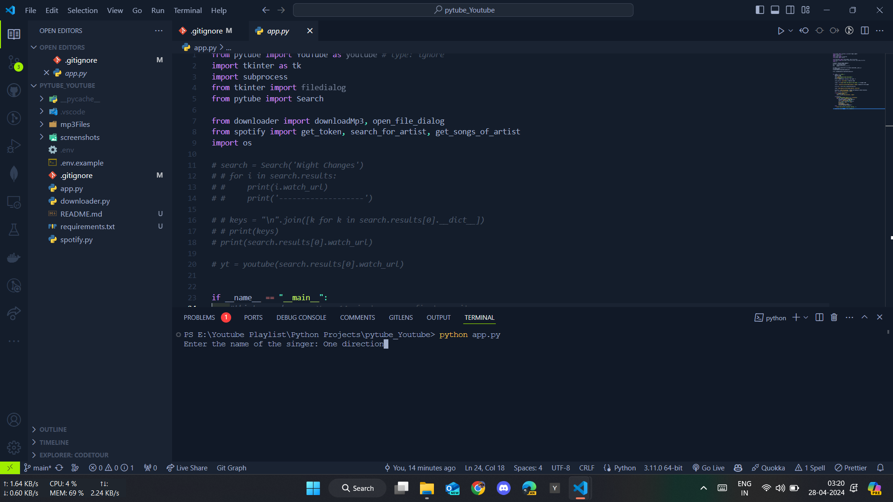
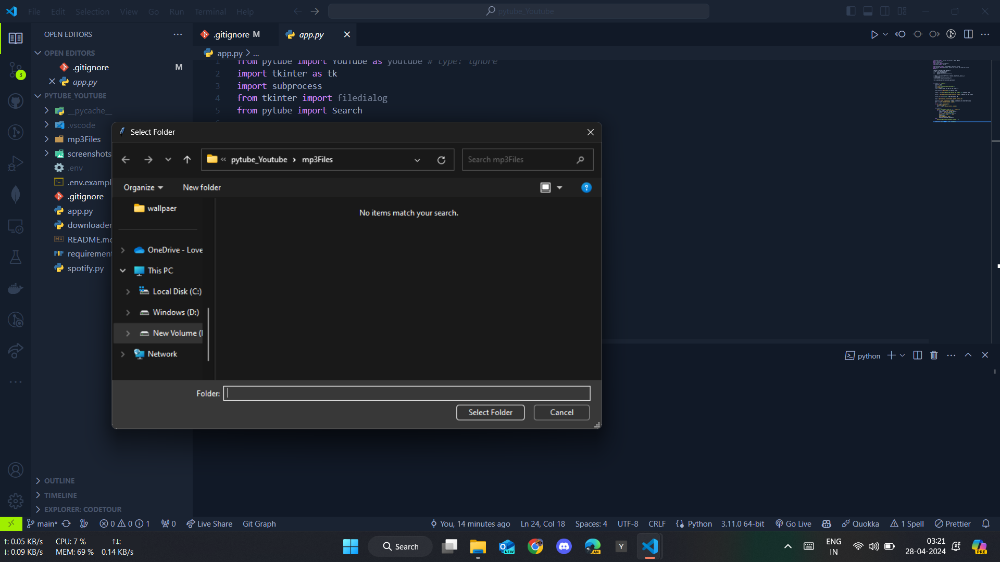
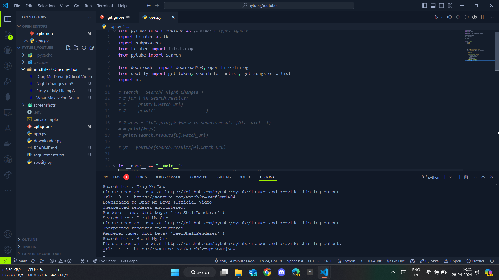

# RhythmReaper

RhythmReaper is a Python application designed to simplify the process of building your music library. By inputting the name of a singer, RhythmReaper connects with Spotify to fetch their top tracks. Leveraging the Pytube library, it seamlessly downloads these tracks in MP3 format, providing users with an efficient way to enjoy their favorite tunes offline.

## Setup Instructions

To set up and run RhythmReaper, follow these steps:

1. **Clone the Repository:**
   - Clone the repository:

    ```bash
     git clone https://github.com/yourusername/RhythmReaper.git
    ```

   - Navigate to the project directory:

     ```bash
     cd RhythmReaper
     ```

2. **Install Requirements:**
   - Install the required packages using pip:

     ```bash
     pip install -r requirements.txt
     ```

3. **Usage:**
   - Run the Python script:

     ```bash
     python app.py
     ```

   - Enter the name of the singer whose songs you want to download when prompted.

## Main Points

- Easily build your music library by fetching top tracks of any singer.
- Seamlessly download tracks in MP3 format for offline enjoyment.
- Simple and user-friendly interface.
- Requires only Python and Pytube library.

## Screenshots

### Singer



### Directory



### Download


